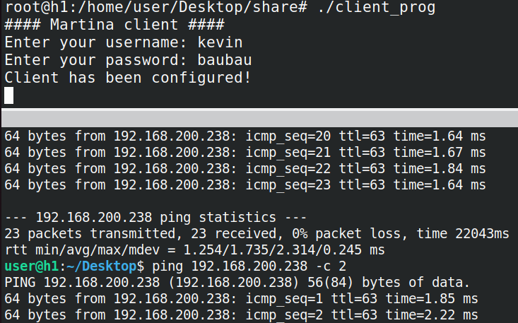
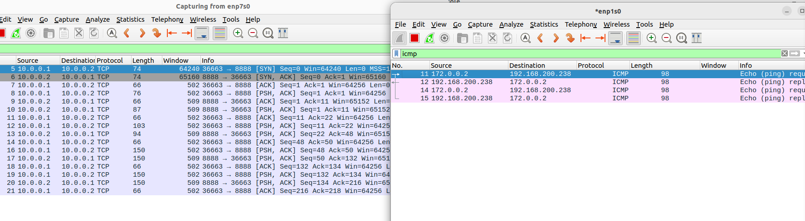

# Martina

Martina is a network service that allows you to create a TCP tunnel through which traffic destined for a local network can travel. Basically, with Martina you can create a tunnel to access a remote network as if your machine were physically inside that network. 

In the following, the __Remote Network__ is what a host wants access to, while the __Private Network__ stands for the overlay network which is built on top of the physical one. Therefore, the last one is where TCP tunnels exist.

## Building

Please make sure you have installed OpenSSL library. If so, just run the Makefile.

```
make all
```

## Usage

On server-side
```
./server_prog <private_network_id> <private_network_mask> <remote_network_id> <remote_network_mask> 
```

On client-side
```c
./client_prog
```

## Screnshots

A host pings a machine which is in the remote network.



On the left, you see both the incoming and outcoming traffic; on the right, you see the traffic exchanged between the server and one of the internal host. On the left, the traffic is encpasulated in TCP segments, while on the other side is sent as it is.




## Contributing

Pull requests are welcome. For major changes, please open an issue first
to discuss what you would like to change.
